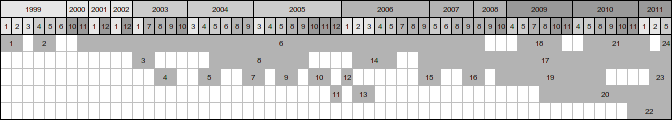

# cv
Curriculum vitae

## Contact information

Name: Richel J.C. Bilderbeek
Street: ---
ZIP code: ---
City: Groningen
Country: The Netherlands
Telephone number: ---
E-mail: ---

## Personal information

Date of birth: the 2nd September of 1980
Place of birth: Milsbeek, The Netherlands
Gender: Male
Homepage: http://www.richelbilderbeek.nl
Nationality: Dutch

## Education

Period   |Education                                                      |Diploma
---------|---------------------------------------------------------------|---
2019     |AIDA freediving level 1                                        |Yes
2019     |Company safety (BHV)                                           |Yes
2017     |Company safety (BHV)                                           |Yes
2016     |Assessment of assignments and Theses                           |Yes
2012-2014|Mechatronics, Alfa Collega, Groningen                          |No
2011     |Company safety (BHV)                                           |Yes
2010     |SolidWorks basics                                              |Yes
2007-2008|University Centre for Learning & Teaching, Groningen           |Yes
2006     |Factory safety (VCA)                                           |Yes
2006     |Basics of forging                                              |Yes
2006     |Basics of welding                                              |Yes
2000     |Safe microbiological techniques (VMT), University of Groningen |Yes
1999-2005|University of Groningen, Biology, focus on Theoretical Biology |Yes
1991-1998|VWO, Pax Christi College, Druten                               |Yes
1990     |Programming in BASIC                                           |Yes

## Work experience

n |Period           |Function
--|-----------------|-------------------------------------------------------------------------------------------
24|May 2015-??? ????|Freelance researcher (future work): development of a generic experimental game theory server with, among others, MSc Lucas Molleman from the Theoretical Biology group at the University of Groningen.
23|Feb 2011-May 2011||Freelance researcher: improving an algorithm in C++ to calculate the probability of a certain phylogeny in cooperation with Dr. Rampal Etienne from the Community and Conservation Ecology group at the University of Groningen.
22|Nov 2010-May 2011|Light- and soundtechnician (voluntarily): ensuring profession lighting and sound for bands or theatre plays for the Prinsentheater in Groningen.
21|May 2010-Jan 2011|Freelance researcher: improving the speed of an algorithm in C++ to calculate the probability of a binary phylogeny in cooperation with Dr. Rampal Etienne from the Community and Conservation Ecology group at the University of Groningen.
20|Aug 2009-May 2011|Freelance stagecraft workshops supervisor: teaching and making a team of secondary school students do the entire stagecraft of a presentation as a member of the ROET (Arnhem) crew.
19|Oct 2008-Aug 2010|Teacher in biology, physics/chemistry and stagecraft: educating third and fourth year secondary school students from the levels of BBL, KBT and TL in the subjects of biology, physics/chemistry and stagecraft at VMBO 't Venster, Arnhem.
18|May 2009-Oct 2009|Freelance researcher: improving an algorithm in C++ to calculate the probability of a certain phylogeny in cooperation with Dr. Rampal Etienne from the Community and Conservation Ecology group at the University of Groningen.
17|Sep 2006-May 2011|C++ trainer: improving the C++ knowledge of beginner and advanced programmers with a tailor-made training for DTS, Meppel.
16|Sep 2007-Oct 2008|LIO ('Teacher In Education') in biology and science: educating first, third and fourth year secondary school students from the levels of TL and VWO in the subjects of biology and science, under the supervision of Maurits Dijkstra at Belcampo, Groningen.
15|Sep 2006-May 2007|Programmer: maintaining and improving the source code of an insurance system written in C, CL, Prolog and embedded SQL for DTS, Meppel.
14|Feb 2006-May 2006|Freelance researcher: developing individual-based simulations in C++ about honest signaling with Dr. T.Veen at Theoretical Biology at the University of Groningen.
13|Feb 2006-Mar 2006|Freelance course supervisor, -developer and teacher 'C++ for biologists': improving, supervising and teaching the course 'C++ for biologists' with Dr. G.S.Van Doorn for Theoretical Biology at the University of Groningen.
12|Jan 2006-Jan 2006|Freelance software developer: developing an application in C++ that executes the administrators' daily startup routine automatically for Transcom Worldwide, Groningen.
11|Dec 2005-Dec 2005|Freelance software developer: developing an application in C++ that reformats Excel sheets automatically, for Transcom Worldwide, Groningen.
10|Oct 2005-Nov 2005|Freelance researcher: developing an individual-based simulation in C++ about cross-species mating with Dr. C.Wiley at Theoretical Biology at the University of Groningen.
9|May 2005-Aug 2005|Student researcher in theoretical biology: developing individual-based simulations in C++ about the influence of phentoypic plasticity on population dynamics under the supervision of Dr. R.Payne at the University of Bristol.
8|May 2004-Sep 2005|Freelance researcher: developing a simulation in C++ visualizing the risk of growing GMO's for the Dutch Commission on Genetic Modification in cooperation with Dr. M.W.Kleefsman-Smith, Prof. F.J.Weissing and Dr. R.Bijlsma (from the University of Groningen) for the Commission on Genetic Modification, Bilthoven
7|Sep 2004-Mar 2005|Student researcher in artificial intelligence: developing an intelligent navigational system in C++ for robots under the supervision of Jr.Prof. C.Igel and Dr. I.Iossifidis at the University of Bochum
6|Nov 2000-Aug 2008|Light- and soundtechnician (voluntarily): ensuring profession lighting and sound for bands or theatre plays for the Prinsentheater in Groningen.
5|Apr 2004-May 2004|Course supervisor, -developer and teacher 'C++ for biologists': improving, supervising and teaching the course 'C++ for biologists' with Drs. D. Reid for Theoretical Biology at the University of Groningen
4|Aug 2003-Oct 2003|Course developer 'C++ for biologists': developing, supervising and teaching the course 'C++ for biologists' with Drs. H. Verkiel commissioned by prof. F.J.Weissing for Theoretical Biology at the University of Groningen
3|Jan 2003-Jul 2003|Student researcher in theoretical biology: developing an individual-based simulation in C++ about the evolution of hermaphroditism under the supervision of Drs. G.S. van Doorn for Theoretical Biology at the University of Groningen
2|Apr 1999-May 1999|Leader homework-camp: Leading a nine-day camp for secondary school students that need aiding in their courses, for Anderwijs, Utrecht
1|Jan 1999-Feb 1999|Leader homework-camp: Leading a nine-day camp for secondary school students that need aiding in their courses, for Anderwijs, Utrecht

## Hobbies

Composing and performing songs on the piano
Programming cross-platform tools, simulations and games, both desktop and webapplications
Handicrafts: welding, forging, sculpturing
Stagecraft, both light and sound engineering
Skateboarding
Studying biology, math, chemistry, physics, astronomy, statistics, quantum mechanics
 
# Language skills

Language|Writing|Speaking
--------|-------|--------  
Dutch   |Good   |Good
English |Good   |Good
German  |Fine   |Fine
